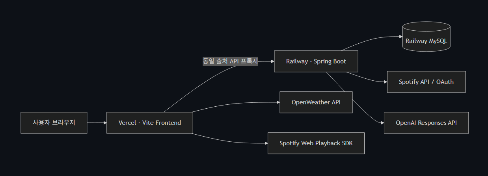

# MoodWave

[](https://github.com/ureca-void/moodwave-frontend/actions/workflows/ci.yml)

## 개인화 음악 추천 스트리밍 플랫폼

**박해준 | Frontend Developer**

---

MoodWave는 Spotify 음악 탐색과 재생을 중심으로 감정·날씨에 어울리는 곡을 추천하고, 사용자가 가장 많이 들은 장르를 분석해 해당 장르의 인기곡을 추천하는 웹 서비스입니다.

저는 프로젝트에서 공통 레이아웃과 해시 라우팅, 홈·검색·플레이리스트·감정 추천 UI, Spotify OAuth 및 Web Playback SDK 기반 플레이어를 구현했습니다.  
프로젝트 종료 후에는 날씨·취향 기반 AI 추천 백엔드를 추가하고, 페이지 생명주기 정리, 요청 취소, 데이터 캐싱, 외부 SDK 지연 로딩, 이미지 최적화까지 진행했습니다.

단순히 기능을 연결하는 데서 끝내지 않고 다음 사용자 흐름이 끊기지 않도록 설계했습니다.

```text
Spotify 로그인
→ 음악 탐색 및 검색
→ 곡 재생과 좋아요·플레이리스트 관리
→ 감정·날씨·취향 기반 추천
→ 추천 곡 연속 탐색 및 재생
```

---

## 주요 성과

- 날씨 이미지 6개 용량 **96.4% 감소**: 14.76 MiB → 0.53 MiB
- Lighthouse Performance **51 → 97**: 배포 환경 개선 후 3회 측정 중앙값
- LCP **6.2초 → 2.0초**, 약 68% 개선
- TBT **1,339ms → 173ms**, 약 87% 개선
- TTI **6.3초 → 2.0초**, 약 68% 개선
- Lighthouse Accessibility·Best Practices **100점**, 콘솔 오류 및 API 실패 요청 0건 확인
- Chart.js와 Spotify Web Playback SDK를 필요한 시점에만 로드하도록 변경
- 공통 곡 테이블에 IntersectionObserver 기반 무한 스크롤, 요청 취소, observer cleanup 적용
- 날씨·취향 추천을 AI 분석과 Spotify 검색으로 연결하고 최대 100곡 페이지네이션 제공
- 취향의 대표 장르가 K-pop일 때만 K-pop 인기곡을 추천하도록 장르 분기 보정
- Vite production build 성공: JS 103.48 kB(gzip 27.40 kB), CSS 54.98 kB(gzip 10.09 kB)
- Playwright E2E 3개 통과: 보호 라우팅·감정 추천·오래된 비동기 응답 차단 검증
- GitHub Actions CI 및 배포 Smoke Test 통과
- Vercel 프론트엔드와 Railway 백엔드 /api/home 실연결 검증
- 추천 서비스 단위 테스트 1개 통과: 실패·오류·건너뜀 0건

---

## 프로젝트 개요

- **프로젝트명:** MoodWave
- **주제:** 개인화 음악 추천 스트리밍 플랫폼
- **개발 기간:** 2026.05.26 ~ 2026.06.04, 총 10일
- **후속 개선:** 2026.06 성능 최적화, 배포 안정화, AI 추천 기능 고도화
- **팀 구성:** 4명
- **포지션:** Frontend / Backend
- **주요 역할:** 공통 UI, 클라이언트 라우팅, 음악 검색·재생, Spotify 인증, 플레이리스트, 감정 추천, 성능 최적화, 날씨·취향 AI 추천 API
- **Frontend:** HTML, CSS, JavaScript, Vite, Chart.js
- **Backend:** Java 17, Spring Boot, Spring Security, OAuth2 Client, MyBatis
- **Database:** MySQL
- **External API:** Spotify Web API, Spotify Web Playback SDK, OpenAI Responses API, OpenWeather API
- **Deploy:** Vercel, Railway, Railway MySQL
- **배포 링크:** https://moodwave-fe.vercel.app/
- **Frontend GitHub:** https://github.com/ureca-void/moodwave-frontend
- **Backend GitHub:** https://github.com/ureca-void/movewave-backend

---

## 문제 정의

일반적인 음악 서비스의 추천은 인기 순위나 장르 중심으로 제공되는 경우가 많습니다.  
하지만 사용자가 실제로 음악을 듣는 이유는 현재 감정, 날씨, 취향처럼 순간적인 맥락과 연결되어 있습니다.

MoodWave는 다음 세 가지 질문을 하나의 서비스에서 해결하는 것을 목표로 했습니다.

1. 지금 듣고 싶은 곡을 빠르게 찾고 바로 재생할 수 있는가?
2. 사용자의 감정이나 날씨처럼 현재 상황을 추천에 반영할 수 있는가?
3. 사용자가 실제로 들은 곡을 분석해 개인화된 다음 음악을 제안할 수 있는가?

이를 위해 Spotify의 실제 음악 데이터와 재생 기능을 기반으로 감정, 날씨, 취향 기반 음악을 AI 추천 흐름에 연결했습니다.

---

## 시스템 구성



프론트엔드는 Vercel에, Spring Boot 백엔드는 Railway에 배포했습니다.  
브라우저에서는 `/api`, `/oauth2`, `/logout`처럼 동일 출처 경로로 요청하고,  
Vercel rewrites가 Railway 백엔드로 전달합니다.  
로컬에서는 Vite proxy가 같은 역할을 수행합니다.

이 구조를 사용해 로컬과 배포 환경의 API 호출 방식을 통일하고, OAuth 세션 쿠키가 필요한 인증 요청에서 교차 출처 문제를 줄였습니다.


---

## 담당 역할

### 공통 레이아웃과 클라이언트 라우팅

Sidebar, Header, Footer Player를 공통 레이아웃으로 구성하고 URL hash를 기준으로 페이지를 전환하는 라우터를 구현했습니다.

로그인이 필요한 검색, 좋아요, 차트, 날씨, 플레이리스트 페이지는 라우팅 전에 사용자 정보를 확인해 접근을 제어했습니다.  
각 페이지 초기화 함수가 cleanup 함수를 반환하도록 정리해 페이지를 이동할 때 이전 이벤트, observer, 네트워크 요청을 정리할 수 있게 했습니다.

### Spotify 로그인과 음악 재생

Spring Security OAuth2 Client를 이용해 Spotify 로그인을 연결하고, 로그인된 사용자만 Spotify access token과 재생 기능을 사용할 수 있도록 구성했습니다.

Spotify Web Playback SDK 기반 Footer Player에서 다음 기능을 구현했습니다.

- 곡 재생과 일시정지
- 이전 곡과 다음 곡
- 재생 위치 이동
- 음량과 음소거
- 셔플과 반복 모드
- 재생 대기열 조회
- 재생 기기 조회
- 전체 화면 플레이어
- 좋아요 등록과 해제

곡 데이터에 Spotify ID가 없는 경우 제목과 아티스트로 트랙을 검색한 뒤 재생 가능한 URI를 찾도록 처리했습니다.

### 음악 탐색과 플레이리스트

홈에서 추천, 인기, 최신 곡을 카드 형태로 제공하고 검색 결과와 Popular, Latest, Liked Songs, 추천 결과를 공통 곡 테이블로 렌더링했습니다.

곡 테이블은 한 번에 전체 데이터를 그리지 않고 IntersectionObserver가 목록 하단을 감지할 때 다음 페이지를 요청합니다.  
사용자는 별도 페이지 버튼 없이 곡을 계속 탐색할 수 있고, 스크롤이 길어지면 TOP 버튼으로 빠르게 상단으로 이동할 수 있습니다.

사용자 플레이리스트는 localStorage에 저장해 새로고침 후에도 유지되도록 했습니다.  
생성, 이름 변경, 삭제, 곡 추가, 곡 삭제, 공유 기능을 구현했습니다.

### 감정 기반 추천

사용자가 입력한 문장을 백엔드 감정 추천 API로 전달하고, AI가 분석한 감정 라벨, 추천 이유, 키워드와 Spotify 추천 곡을 렌더링했습니다.

이전 추천 요청이 진행 중인 상태에서 다시 요청하거나 페이지를 이동하면 AbortController로 기존 요청을 취소해 오래된 응답이 현재 화면을 덮어쓰지 않도록 했습니다.  
AI 응답과 곡 데이터는 escapeHTML을 거쳐 출력해 동적 HTML 렌더링의 XSS 위험도 줄였습니다.

### 날씨·취향 기반 추천

날씨 기반 추천은 현재 날씨를 정규화한 뒤 OpenAI가 분위기와 검색 키워드를 생성하고, 해당 키워드로 Spotify 곡을 수집하도록 구현했습니다.

취향 기반 추천은 사용자의 Spotify 최근 재생 곡을 가져와 가장 많이 들은 대표 장르와 장르 분포를 분석합니다.  
대표 장르의 인기곡·히트곡 검색어로 최대 100곡을 수집하고 공통 무한 스크롤 테이블에 제공합니다.

K-pop 추천이 다른 장르에 섞이는 문제를 해결하기 위해 대표 장르가 K-pop일 때만  
K-pop 인기 검색어를 사용하고, Indie·R&B·Rock 등 다른 장르에서는 K-pop 검색어를 제거했습니다.  
AI 호출이나 Spotify 검색이 실패해도 규칙 기반 분석과 인기곡으로 복구되는 fallback도 추가했습니다.

---

## 기술 선택과 설계 판단

### Vanilla JavaScript와 Vite

10일 미니 프로젝트라는 일정과 팀의 학습 목표를 고려해 프레임워크 없이 HTML, CSS, JavaScript로 UI와 상태 흐름을 직접 구현했습니다.

대신 Vite를 사용해 ES Module 기반 개발 환경, 환경변수, 로컬 API proxy, production build를 구성했습니다.  
이를 통해 프레임워크 없이도 개발 서버와 배포 산출물을 일관되게 관리했습니다.

### 페이지 init/cleanup 계약

SPA처럼 화면만 교체하는 구조에서는 페이지를 다시 방문할 때 이벤트 리스너와 observer가 중복 등록될 수 있습니다.  
이를 막기 위해 모든 페이지 초기화 함수가 필요하면 cleanup 함수를 반환하도록 규칙을 정했습니다.

```javascript
async function renderPage(main, route) {
  cleanupActivePage();
  main.innerHTML = route.render();

  if (route.init) {
    const cleanup = await route.init();
    activePageCleanup = typeof cleanup === "function" ? cleanup : null;
  }
}
```

라우트가 변경되면 이전 cleanup을 먼저 실행하고 새 화면을 초기화합니다.  
이벤트 해제, 요청 취소, IntersectionObserver 연결 해제, Chart instance 제거가 같은 생명주기 안에서 처리됩니다.

### 공통 곡 테이블

Popular, Latest, Liked Songs, 날씨 추천, 취향 추천은 화면 제목과 API만 다르고 목록 동작은 동일했습니다.  
중복 구현 대신 렌더링과 무한 스크롤을 하나의 공통 컴포넌트로 통합했습니다.

```javascript
activeObserver = new IntersectionObserver(
  (entries) => {
    if (entries[0].isIntersecting) {
      renderMoreSongs(options);
    }
  },
  {
    root: scrollRoot,
    rootMargin: "200px",
    threshold: 0,
  },
);
```

화면에서 벗어나기 전에 다음 페이지를 미리 요청하도록 `rootMargin: "200px"`를 적용했습니다.  
페이지 이동 시 observer와 진행 중인 fetch를 함께 종료해 불필요한 렌더링을 방지했습니다.

### 동일 출처 API 프록시

프론트와 백엔드가 Vercel과 Railway로 분리되어 있지만 브라우저에서는 상대 경로만 사용합니다.

```javascript
export const API_BASE_URL = "";
export const HOME_API_URL = `${API_BASE_URL}/api/home`;
export const SPOTIFY_LOGIN_API_URL = `${API_BASE_URL}/oauth2/authorization/spotify`;
```

로컬에서는 Vite proxy, 배포에서는 Vercel rewrites가 Railway로 요청을 전달합니다.  
코드에서 환경별 서버 주소 분기를 반복하지 않고 OAuth redirect와 session cookie 흐름도 동일하게 유지할 수 있었습니다.

### AI 분석과 Spotify 검색의 역할 분리

OpenAI는 실제 곡 목록을 직접 생성하지 않고 사용자의 맥락을 구조화하고 Spotify 검색 키워드를 생성하는 역할만 담당합니다.  
실제 재생 가능한 음악 데이터는 Spotify에서 조회합니다.

OpenAI Responses API에 JSON Schema를 적용해 감정 라벨, 추천 이유, 대표 장르, 키워드, 통계 데이터의 형식을 고정했습니다.  
이후 키워드를 병합·정규화하고 Spotify 검색 결과의 중복과 특정 아티스트 편중을 제한했습니다.

---

## 트러블슈팅 1. 대용량 날씨 이미지 최적화

### 문제

날씨 배경 JPG 6개의 합계가 15,476,800 bytes, 약 14.76 MiB였습니다.  
`sunny.jpg` 한 장만 약 4.44 MiB였고, 날씨 페이지 진입 시 이미지 다운로드와 디코딩 비용이 크게 발생했습니다.

### 해결

- 원본 JPG를 화면 표시 크기에 맞게 리사이즈
- WebP 형식으로 변환
- 기존 JPG 삭제 후 코드 경로를 WebP로 변경
- 이미지에 width와 height를 지정해 레이아웃 이동 방지
- 화면 우선순위에 따라 lazy/eager loading과 async decoding 적용

### 결과

| 항목            |   개선 전 |  개선 후 |                  결과 |
| --------------- | --------: | -------: | --------------------: |
| 날씨 이미지 6개 | 14.76 MiB | 0.53 MiB |            96.4% 감소 |
| 파일 형식       |       JPG |     WebP | 전송·디코딩 비용 감소 |

---

## 트러블슈팅 2. 외부 SDK의 초기 로딩 비용 제거

### 문제

Chart.js를 `index.html`에서 불러오면 차트 페이지를 사용하지 않는 사용자도 라이브러리를 내려받아야 했습니다.  
Spotify Web Playback SDK도 앱 시작 시 초기화되어 로그인하지 않거나 음악을 재생하지 않는 사용자에게 불필요한 네트워크 요청이 발생했습니다.

### 해결

Chart.js는 차트 페이지 진입 시, Spotify SDK는 실제 재생 기능이 필요한 시점에 동적으로 script를 추가했습니다.  
같은 시점에 여러 초기화 요청이 들어오는 상황에서는 공유 Promise를 반환해 스크립트가 중복 삽입되지 않도록 했습니다.

```javascript
function loadChartJs() {
  if (window.Chart) return Promise.resolve(window.Chart);
  if (chartJsLoadPromise) return chartJsLoadPromise;

  chartJsLoadPromise = new Promise((resolve, reject) => {
    const script = document.createElement("script");
    script.src = CHART_JS_URL;
    script.async = true;
    script.onload = () => resolve(window.Chart);
    script.onerror = reject;
    document.head.append(script);
  });

  return chartJsLoadPromise;
}
```

### 결과

- 홈 초기 실행에서 Chart.js CDN 요청 제거
- 로그인·재생 전 Spotify SDK 요청 제거
- 중복 script 삽입과 중복 player 초기화 방지
- 외부 서비스 장애가 앱 전체 초기화에 영향을 주는 범위 축소

---

## 트러블슈팅 3. 페이지 재진입 시 중복 작업 방지

### 문제

hash 기반으로 Main 영역만 교체하기 때문에 이벤트 리스너, IntersectionObserver, Chart instance, fetch 요청을 정리하지 않으면 페이지 재진입 횟수만큼 작업이 누적될 수 있었습니다.

또한, 사용자가 빠르게 검색어를 바꾸거나 추천 페이지를 이동하면 이전 요청이 늦게 완료되어 현재 화면에 오래된 데이터를 렌더링할 가능성이 있었습니다.

### 해결

- 페이지별 cleanup 함수 반환
- 이벤트 핸들러 removeEventListener 처리
- IntersectionObserver disconnect 처리
- Chart instance destroy 처리
- AbortController로 이전 fetch 취소
- runId를 비교해 현재 페이지 실행과 다른 응답 무시
- 동일 요청은 진행 중인 Promise를 공유해 중복 호출 방지

```javascript
return () => {
  activeSongTableRunId++;
  abortActiveSongFetch();
  disconnectActiveObserver();
  cleanupTopButton?.();
};
```

### 결과

페이지를 반복 이동해도 observer와 네트워크 요청이 누적되지 않도록 했고, 이미 사라진 DOM에 비동기 응답이 렌더링되는 문제를 방지했습니다.

---

## 트러블슈팅 4. API 중복 호출과 응답 지연 개선

### 문제

홈, 날씨, 사용자 인증, 차트 데이터는 페이지 이동 때마다 다시 요청됐습니다.  
카드에 Spotify ID가 없는 경우 동일한 제목과 아티스트를 반복 검색했고, access token 요청도 여러 재생 동작에서 중복될 수 있었습니다.

### 해결

- 홈·차트·추천 데이터: 5분 TTL cache
- 날씨 데이터: 좌표별 10분 TTL Map cache
- 인증 사용자: 30초 TTL cache
- Spotify access token: 유효시간 기반 cache
- 트랙 검색: 검색어별 Map cache
- 같은 데이터의 진행 중 요청: Promise 공유
- 401 응답 시 token cache 제거 후 한 번만 재발급해 재시도

### 결과

페이지 재진입과 연속 사용자 동작에서 동일 API 호출 수를 줄였고, 서버 응답을 기다리지 않고 캐시 데이터를 즉시 재사용할 수 있게 했습니다.

---

## 트러블슈팅 5. 곡 전환 시 이전 재생 위치가 노출되는 문제

### 문제

한 곡을 약 1분 동안 듣다가 다른 곡을 선택하면 Spotify player state가 갱신되기 전까지 이전 곡의 재생 위치가 새 곡에 표시되는 현상이 간헐적으로 발생했습니다.

### 원인

곡 정보는 먼저 새 곡으로 바뀌지만 재생 위치는 Spotify SDK의 다음 상태 이벤트가 올 때까지 이전 값을 유지하고 있었습니다.  
UI와 실제 재생 상태의 갱신 시점이 달랐습니다.

### 해결

새 곡 재생 요청 직전에 진행 타이머, 현재 위치, 전체 길이, 시간 텍스트, 진행바를 즉시 0으로 초기화했습니다.  
이후 Spotify SDK 상태가 도착하면 실제 값으로 다시 동기화했습니다.

```javascript
function resetProgressForTrackChange() {
  stopProgressTimer();
  currentDuration = 0;
  currentPosition = 0;

  currentTime.textContent = "0:00";
  durationTime.textContent = "0:00";
  progressBar.style.width = "0%";
}
```

### 결과

곡 제목과 커버가 바뀐 직후 이전 곡의 재생 시간이 노출되지 않고, 항상 0초에서 시작한 뒤 실제 player state와 동기화됩니다.

---

## 트러블슈팅 6. 취향 추천에 K-pop이 과도하게 섞이는 문제

### 문제

사용자의 대표 장르가 Indie로 분석되어도 검색 키워드에 K-pop이 섞이면서 K-pop 인기곡 100곡이 추천되는 문제가 있었습니다.

### 원인

AI가 생성한 검색 키워드를 그대로 사용해 대표 장르와 검색 결과의 일관성이 보장되지 않았습니다.  
한국 사용자용 추천을 의도한 프롬프트가 모든 장르에 K-pop 키워드를 섞는 방향으로 작동할 수 있었습니다.

### 해결

- `dominantGenre`를 기준으로 K-pop 여부를 명시적으로 판별
- K-pop일 때만 K-pop 인기곡 전용 검색어 사용
- 다른 장르에서는 AI 키워드 중 K-pop 관련 검색어 제거
- `popular {genre}`, `{genre} hits`, `{genre} playlist` 기본 검색어 추가
- 특정 아티스트는 최대 3곡까지만 포함
- AI 실패 시 최근 재생 곡을 규칙 기반으로 분석하는 fallback 제공
- 분석 및 추천 결과를 5분간 캐시
- 최대 100곡을 생성하고 API에서 page와 limit 기준으로 분할 응답

```java
boolean kpopTaste = isKpopText(normalizedAnalysis.dominantGenre());

List<String> keywords = kpopTaste
        ? createPopularKpopKeywords()
        : mergeKeywords(
                createTasteBaseKeywords(normalizedAnalysis),
                removeKpopKeywords(normalizedAnalysis.keywords())
        );
```

### 결과

대표 장르가 K-pop일 때는 K-pop 인기곡을 추천하고, Indie·R&B·Rock 등 다른 장르에서는 해당 장르와 분위기에 맞는 곡을 추천하도록 분기를 명확히 했습니다.  
이 동작은 단위 테스트로 검증했습니다.

---

## 성능 개선 상세

### 홈 LCP 이미지 우선순위 조정

홈 첫 화면에 보이는 Popular 카드까지 `loading="lazy"`가 적용되어 LCP 이미지 요청이 늦게 시작되는 문제가 있었습니다.

첫 화면에 노출되는 이미지는 `loading="eager"`, `fetchpriority="high"`로 우선 요청하고, 화면 아래 Latest 이미지는 `loading="lazy"`로 유지했습니다.  
Spotify 640px 커버 URL은 300px URL로 치환하고, CDN origin에는 preconnect를 적용했습니다.

```javascript
function getOptimizedCoverUrl(cover = "") {
  return cover.replace("/image/ab67616d0000b273", "/image/ab67616d00001e02");
}

const loading = isPriorityImage ? "eager" : "lazy";
const fetchPriority = isPriorityImage ? 'fetchpriority="high"' : "";
```

### Lighthouse 측정 결과

측정 환경은 Vercel 프론트엔드와 Railway 백엔드가 연결된 실제 배포 주소입니다  
Lighthouse 기본 mobile 환경에서 개선 전 1회, 개선 후 3회를 실행했고 개선 후 값은 중앙값으로 정리했습니다.

| 지표        | 개선 전 | 개선 후 |            변화 |
| ----------- | ------: | ------: | --------------: |
| Performance |      51 |      97 |           +46점 |
| FCP         |   1.5초 |   1.3초 |     약 16% 개선 |
| LCP         |   6.2초 |   2.0초 |     약 68% 개선 |
| Speed Index |   3.2초 |   2.3초 |     약 30% 개선 |
| TBT         | 1,339ms |   173ms |     약 87% 개선 |
| CLS         |   0.004 |   0.003 | 안정적으로 유지 |
| TTI         |   6.3초 |   2.0초 |     약 68% 개선 |

개선 후 `/api/home`과 `/api/user` 응답은 모두 HTTP 200이었고 콘솔 오류는 없었습니다.  
Accessibility와 Best Practices는 100점, SEO는 91점이었습니다.

---

## 성능 및 품질 검증

### Frontend production build

```text
Vite 8.1.0
42 modules transformed
JS  103.48 kB / gzip 27.40 kB
CSS 54.98 kB / gzip 10.09 kB
build success
```

### Lighthouse

- Performance 3회 측정: 97, 97, 90
- Performance 중앙값: 97
- Accessibility: 100
- Best Practices: 100
- SEO: 91
- API 실패 요청: 0
- 콘솔 오류: 0

### Backend unit test

- `RecommendationServiceTest`: 1개 통과
- Failures: 0
- Errors: 0
- Skipped: 0
- 검증 내용: 대표 장르가 Indie이면 K-pop 검색어와 K-pop 전용 추천 경로를 사용하지 않음

### Frontend E2E

- Playwright E2E: 3개 통과
- 보호 라우팅, 감정 추천, 오래된 비동기 응답 차단 검증

### CI 및 배포 검증

- GitHub Actions CI 통과
- Deployment Smoke Test 통과
- Vercel 프론트엔드와 Railway 백엔드 /api/home 실연결 확인

---

## UI

### Main Page

홈에서는 Ureca's Pick, Popular, Latest 음악을 제공하고 좌측 Sidebar, 상단 검색·프로필, 하단 고정 Footer Player로 음악 탐색과 재생을 하나의 화면에서 처리합니다.


### Music List Page

Popular, Latest, Liked Songs, AI 추천 결과를 같은 곡 테이블 구조로 제공해 페이지별 사용 방법을 통일했습니다.


---

## 프로젝트를 통해 배운 점

이 프로젝트에서 가장 크게 배운 것은 비동기 기능이 많은 서비스에서는 화면 구현보다 생명주기와 상태 동기화가 더 중요하다는 점입니다.

Spotify player state, API 응답, 페이지 이동, 진행 타이머가 각각 다른 시점에 동작하기 때문에 단순히 이벤트를 추가하는 방식으로는 간헐적인 오류와 중복 작업을 막기 어려웠습니다.  
cleanup 함수, AbortController, runId, Promise 공유, TTL cache를 적용하면서 비동기 작업의 시작과 종료 조건을 명확히 관리하게 됐습니다.

또한 AI가 직접 곡을 생성하게 하는 대신 AI는 사용자의 맥락을 구조화하고, 실제 곡은 Spotify에서 조회하도록 역할을 분리했습니다.  
AI 응답을 그대로 신뢰하지 않고 JSON Schema, 장르 분기, 키워드 정규화, fallback, 단위 테스트를 추가하면서 추천 품질은 프롬프트뿐 아니라 후처리 로직으로도 보장해야 한다는 점을 배웠습니다.

성능 개선에서도 감으로 수정하지 않고 정적 자산 크기, production build, Lighthouse를 기준으로 병목을 확인했습니다.  
특히, 모든 이미지에 lazy loading을 적용하는 것이 항상 정답이 아니며 LCP 후보처럼 첫 화면에 필요한 이미지는 오히려 우선 요청해야 한다는 점을 실제 수치로 확인했습니다.

---

## 아쉬운 점과 향후 개선

- `footer.js`가 Spotify player의 인증, SDK, 상태, UI, 이벤트를 함께 담당해 2,000줄 이상으로 커졌습니다. Player API, 상태 저장소, UI renderer, event controller로 분리할 필요가 있습니다.
- JavaScript 코드에 정적 타입이 없어 외부 API 응답 변경을 빌드 단계에서 잡기 어렵습니다. TypeScript와 API schema 기반 타입 생성을 적용하고 싶습니다.
- 현재 자동화 테스트는 추천 장르 분기와 보호 라우팅·감정 추천·오래된 비동기 응답 차단을 검증합니다. 향후 플레이어 상태 전환, 페이지 cleanup, 무한 스크롤, OAuth 실패 복구까지 테스트 범위를 확장할 필요가 있습니다.
- Lighthouse LCP를 2.0초까지 낮춰 2.5초 이내 목표를 달성했습니다. 향후 실제 사용자 환경의 Core Web Vitals도 수집해 실험실 지표와 함께 관리할 필요가 있습니다.
- AI·Spotify·OpenWeather 외부 서비스 장애에 대비해 사용자 재시도 UX와 관측 가능한 오류 로깅을 강화할 필요가 있습니다.
- 현재 플레이리스트는 localStorage 기반입니다. 계정 기반 서버 저장으로 전환하면 기기 간 동기화와 데이터 복구가 가능합니다.
