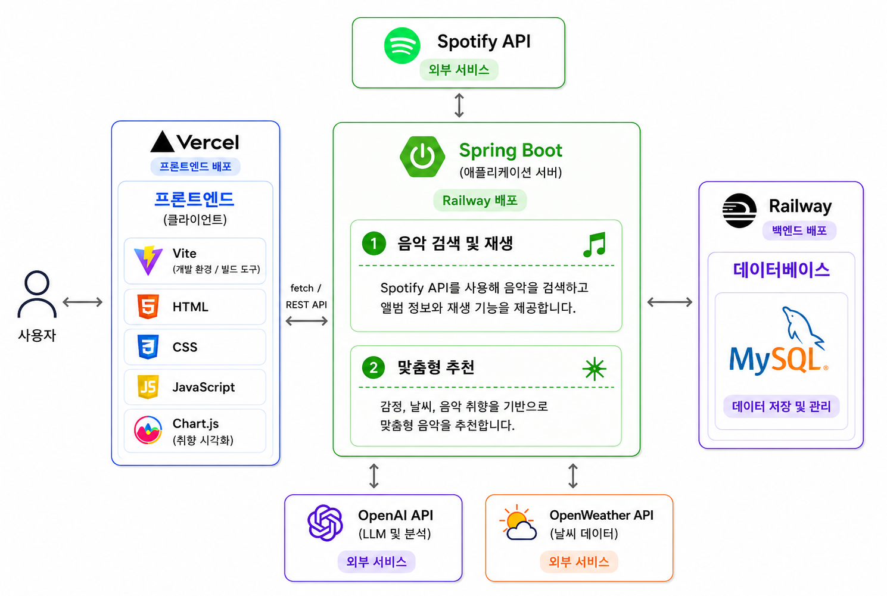
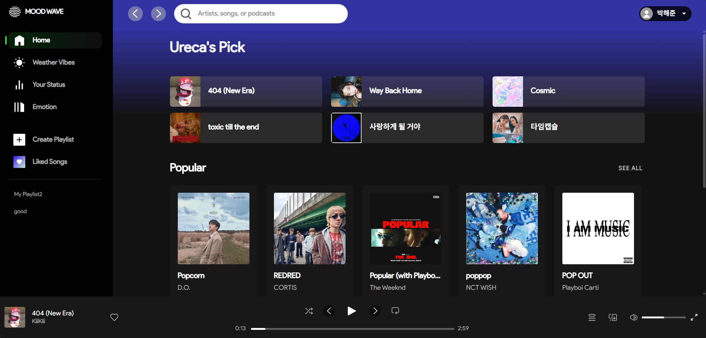
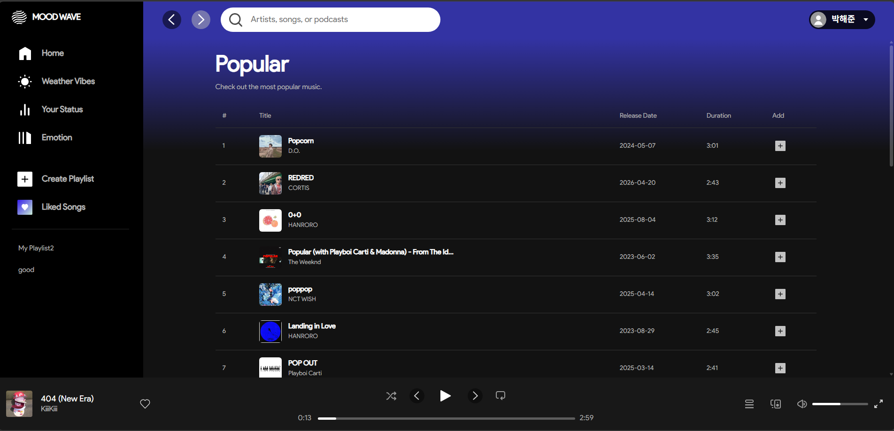

# MOOD WAVE

음악 스트리밍 개인화 추천 웹 서비스

---

## Live Demo

[MOOD WAVE 바로가기](https://moodwave-fe.vercel.app/)

---

## Introduction

**MOOD WAVE**는 사용자가 음악을 검색하고 재생할 수 있을 뿐만 아니라,  
AI 감정 분석, 날씨 기반 추천, 음악 취향 분석 기능을 제공하는 음악 웹 서비스입니다.

사용자의 감정, 현재 날씨, 음악 감상 데이터를 기반으로  
상황에 맞는 개인화 음악 추천 경험을 제공하는 것을 목표로 합니다.

---

## Development Period

2026.05.26 ~ 2026.06.04  
총 10일간 진행한 미니 프로젝트입니다.

---

## Team

<table>
  <tr>
    <td align="center" width="180px">
      <a href="https://github.com/jun6390">
        
         
        <b>박해준</b>
      </a>
       
      <b>FE / BE</b>
    </td>
    <td align="center" width="180px">
      <a href="https://github.com/donghyeon01">
        
         
        <b>송동현</b>
      </a>
       
      <b>FE / BE</b>
    </td>
    <td align="center" width="180px">
      <a href="https://github.com/Ppakso">
        
         
        <b>박소연</b>
      </a>
       
      <b>FE</b>
    </td>
    <td align="center" width="180px">
      <a href="https://github.com/cece-297">
        
         
        <b>이수아</b>
      </a>
       
      <b>FE</b>
    </td>
  </tr>
</table>

---

## Tech Stack

<table>
  <tr>
    <th width="120px">Frontend</th>
    <td>
      
      
      
      
    </td>
  </tr>
  <tr>
    <th width="120px">Backend</th>
    <td>
      
    </td>
  </tr>
  <tr>
    <th width="120px">Database</th>
    <td>
      
    </td>
  </tr>
  <tr>
    <th width="120px">API</th>
    <td>
      
      
      
    </td>
  </tr>
  <tr>
    <th width="120px">Library</th>
    <td>
      
    </td>
  </tr>
  <tr>
    <th width="120px">Deploy</th>
    <td>
      
      
    </td>
  </tr>
</table>

---

## Main Features

### 음악 검색 및 재생

Spotify API를 활용하여 음악을 검색하고,  
앨범 이미지, 아티스트 정보, 곡 정보를 함께 제공합니다.

사용자는 원하는 곡을 선택하여 하단 Footer Player에서  
재생, 일시정지, 이전 곡, 다음 곡, 진행바, 볼륨 조절 기능을 사용할 수 있습니다.

### AI 감정 기반 추천

사용자가 입력한 감정 문장을 OpenAI API로 분석하여  
현재 감정에 어울리는 음악을 추천합니다.

### 날씨 기반 추천

OpenWeather API를 활용하여 현재 날씨 데이터를 가져오고,  
날씨 분위기에 맞는 음악을 추천합니다.

### 음악 취향 분석

사용자의 음악 감상 데이터를 기반으로  
장르, 날씨 등 취향 데이터를 시각화합니다.

---

## Architecture

MOOD WAVE는 프론트엔드를 **Vercel**, 백엔드를 **Railway**에 배포했습니다.  
프론트엔드는 사용자와 직접 상호작용하며, 백엔드 Spring Boot 서버와 REST API 방식으로 통신합니다.  
백엔드는 Spotify API, OpenAI API, OpenWeather API와 연동하고, 데이터는 Railway MySQL에 저장 및 관리합니다.

  

---

## UI Design

### Main Page

MOOD WAVE의 메인 화면은 Spotify 스타일의 음악 스트리밍 웹앱 레이아웃을 참고하여 제작했습니다.  
좌측에는 주요 메뉴와 라이브러리 영역을 배치하고, 상단에는 검색창과 프로필 영역을 구성했습니다.  
메인 영역에서는 Ureca's Pick, Popular, Latest 등 사용자가 음악을 쉽게 탐색할 수 있는 섹션을 제공합니다.  
하단에는 현재 재생 중인 음악 정보와 재생 컨트롤러를 포함한 고정형 Footer Player를 배치했습니다.

  

 

### Music List Page

음악 리스트 화면은 Popular, Latest, Liked Songs 등 다양한 음악 목록을 표 형태로 확인할 수 있도록 구성했습니다.  
각 음악은 순번, 앨범 이미지, 제목, 아티스트, 발매일, 재생 시간, 추가 버튼으로 구분하여 표시됩니다.  
사용자는 리스트에서 음악 정보를 한눈에 확인하고, 원하는 곡을 선택하거나 플레이리스트에 추가할 수 있습니다.

  

---

## Deployment

| Part     | Platform      |
| -------- | ------------- |
| Frontend | Vercel        |
| Backend  | Railway       |
| Database | Railway MySQL |

---

## Folder Structure

<pre>
MOODWAVE-FE
├── docs
│   └── README Images
├── public
│   └── assets
│       ├── icon
│       └── img     
├── src
│   ├── assets
│   │   ├── css
│   │   │   ├── setting
│   │   │   ├── components
│   │   │   └── pages
│   │   └── js
│   │       ├── api
│   │       ├── components
│   │       ├── pages
│   │       └── utils
│   ├── data.js
│   └── main.js
├── index.html
├── package.json
├── vite.config.js
└── README.md
</pre>

---

## Project Summary

MOOD WAVE는 단순한 음악 검색 서비스를 넘어  
사용자의 감정, 날씨, 음악 취향 데이터를 활용하여  
개인화된 음악 추천 경험을 제공하는 웹 서비스입니다.

프론트엔드는 Vite 기반의 HTML, CSS, JavaScript로 구현했으며,  
백엔드는 Spring Boot를 사용하여 Spotify API, OpenAI API, OpenWeather API와 연동했습니다.  
서비스는 Vercel과 Railway를 통해 배포하여 실제 웹 환경에서 사용할 수 있도록 구성했습니다.
